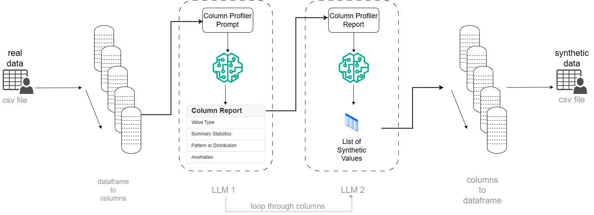

# synthetic_data_generation_LLM

Please read my blog post for a comparison between SDV and LLM.



Before you start, please create a `.env` and fill in your OpenAI API token.

```bash
cp ./env_template ./.env
```

Next, install dependencies.

```bash
pip install -r ./requirements.txt
```

Last, test the code with a few rows.

```bash
 python main.py -d real_data -o True \
    -n 5 -s 10 \
    -c billing_address index credit_card_number
```